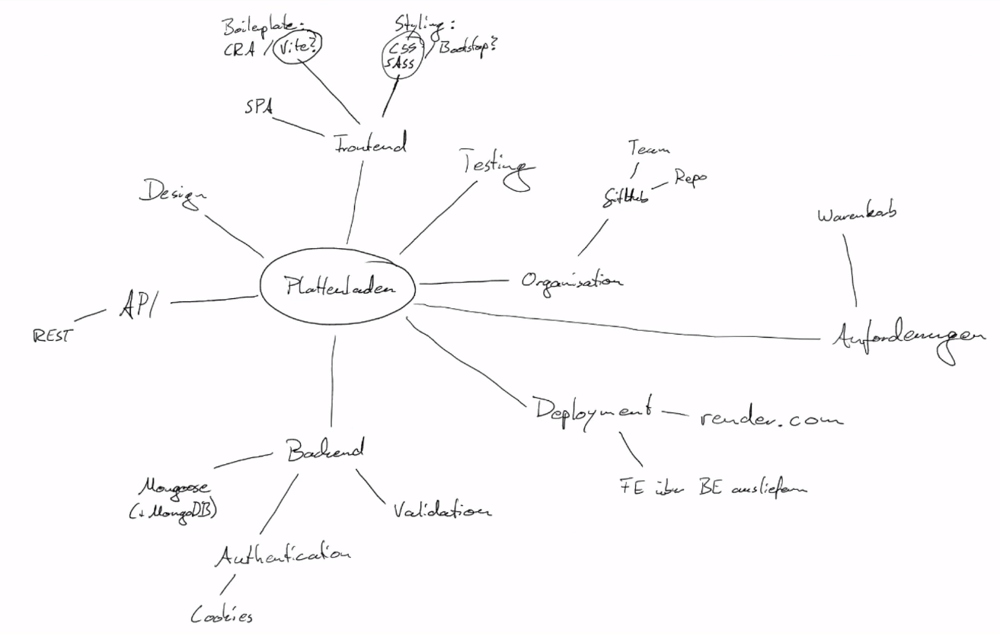

# 🔵 PROGRAMMING BASICS (PBA)


## <u>FORMS</u>

    const inputs = document.getElementById("my-form").elements;
    const inputByIndex = inputs[0];
    const inputByName = inputs["username"];
    const inputByNameAlt = inputs.username;

# 🔵 SINGLE PAGE APPLICATION (SPA)

Solution when javaScript is used in the script tag, in order to prevent js beeing loaded before the DOM

    addEventListener('DOMContentLoaded', (event) => {});


## File structuring

- src folder | main folder for all files

## <u>package.json</u>
create a new package.json (-y to skip prompts)

    npm init | npm init -y
- package name | name for the app
- version | starting withh 0.1
- description | infos to the app
- entry point | skip
- test commmand | skip
- git respository | skip
- keywords |
- author |
- license | ISC
  
#### dependencies

- dependencies | necessary other packeges to run our package
- node_modules | contains all necessary folders

## <u>node package manager (npm)</u>

- npmjs.com | homepage

### install a package
--save installs explicitly to the dependencies section

    npm i <name> | npm install --save <name>

## <u>node package manager (npm)</u>

- packs many different js files into one js file
- npm install webpack webpack-cli
- dist/main.js

## scripts inside package.json
- build script
  
        "build": "webpack"

- watch script
  
        "watch": "webpack --watch"

- running scripts
  
        npm run <script-name>

## webpack.config.js (in main folder)
    module.exports = {
        mode: "development"
    }

----

## Asynchronous code - 

## <u> PROMISES </u>
    function kochen(){
        const kochMeldet = Match.random() > 0.5;
        return new Promise((resolve, reject)=>{
            console.log("kochen");
            if (kochMeldet === true){
                resolve("zubereitetes Gericht");
            } else {
                reject("Gericht nicht zubereitet")
            }
        })
    }

    kochen().then((gericht)=>{
        console.log("servieren", gericht)
    }).catch(()=>{
        console.log("nicht servieren")
    }).finally(()=>{
        console.log("der Koch hat gesprochen")
    })

three stages of promise:
- pending
- resolved
- rejected

## <u>ASYNC AWAIT</u>

await is only working in an async function

    async function handleNumbers(number){
        const value = await isZero(0);
    }

    try {
        const p1 = method1();
        const p2 = method2();
  
        await Promise.all([p1, p2]);
    } 
    catch (error) {
        console.log(e);
    }

-------

## <u>FETCH</u>

  readable stream before using response.json()

### fetch with nested then

    fetch("https://swapi.de/api/people/8")
    .then((response)=>{
        console.log(response.status);
        if (response.status === 200){
            response.json().then((result)=>{
                console.log(result);
            })
        } else {
            throw new Error("Kein Character gefunden");
        }
    })

### fetch with chained then

    fetch("https://swapi.de/api/people/8")
    .then((response)=>{
        console.log(response.status);
        if (response.status === 200){
            return response.json()
        } else {
            throw new Error("Kein Character gefunden");
        }
    }).then((result)=>{
            console.log(result);
    }).catch((err)=>{
        console.log(err);
    })

### fetch with async await

    const getCharacter = async ()=>{
        try {
            const response = await fetch("https://swapi.de/api/people/8");
            if (response.status === 200){
            const result = await response.json();
            consle.log(result);
            } else {
                throw new Error("Kein Character gefunden");
            }
        } catch (error) {
            console.log(error)
        }

    }

    getCharacter();


## POST request

    const postCharacter = async ()=>{
        try {
            const response = await fetch(".../profile", {
                method: "POST",
                body: JSON.stringify({name: "Lightning Man"})
            })
            if (response.status !== 201){
                throw new Error("POST war nicht erfolgreich")
            }
        } catch(err) {
            console.log(error);
        }
    }

----

## LOCAL STORAGE / SESSION STORAGE

    const designMode = window.localStorage.getItem("designMode");
    const newDesignMode = designMode === "dark" ? "light" : "dark";

    window.localStorage.setItem("designMode", newDesignMode)

    getTaskList = JSON.parse(window.localStorage.getItem("task")) || [];
    window.localStorage.setItem("task", JSON.stringify(getTaskList));

----
## Website for generating testdata

[Mockaroo](https://mockaroo.com)


## Create a testserver with json-server

    npm i -g json-server

Run the testserver (-p flag for port is optional)

    json-server -p4001 <filename>

<br> 

---- 

<br>

- Framework (mehrere vorgefertigte Systeme, wie ein feststehendes Fachwerkhaus, man hat einen festgelegten Rahmen mit dem man arbeitet - Angular. Vue ist zwischen Angular und React)
- Library (man holt sich viele kleine Bausteine und setzt die zusammen - React)

 

  
## <u>REACT</u>
<br>

- create react app
- npx - executes a package instead of installing
-     npx create-react-app <name>
-     npm start
  

- src/App.js
- src/index.js (initialisation of the react app)
- public/index.html (html to be delivered)
  


        import logo from "./logo.svg"
        

- looping over arrays in jsx

        data.map((element, index)=>(
            <li key={index}>{element}</li>
        ))

### <u>Function component</u>


- in component

        function Navigation(){
            return (
                <nav>
                    <ul>
                        <li></li>
                        <li></li>
                        <li></li>
                    </ul>
                </nav>
            );
        }

- in index.js

        export default Navigation;


        import Navigation from "./components/Navigation";

        <React.StrictMode>
            <Navigation />
        </React.StrictMode>


### Props

    navLabel="Link 1"
    {props.navLabel}


## React manual installation

- npm init
- npm install react react-dom react-scripts
- creating a .gitignore file with following content:
  - /node_modules
- create src folder inside:
  - index.js - inside:
  
```
    import React from "react";
    import ReactDOM from "react-dom/client";
    import App from ".App";
    const root = ReactDOM.createRoot(document.getElementById("root"));

    root.render(
        <React.StrictMode>
        </React.StrictMode>
    )
```
  - App.js - inside:


```
function App(){
        return (<div className="App">
    <h1>Hello World</h1>
    </div>
      )
    }
  - export default App

- create public folder inside:
  - index.html
  <div id="root"></div>
```

---------------

## <u>useState hook</u>

```
import {useState} from "react";
const [message, setMessage] = useState(false);
```

## <u>useEffect hook</u>
1. mounting
```
useEffect(()=>{
    console.log("Log when component mounts")
}, [])
```
2. updating
```
useEffect(()=>{
    console.log("Log when counter is updated")
}, [counter])
```
3. unmounting
``` js
useEffect(() => ()=> {
    console.log("Log when component will unmount")
}, [])

```

## <u>Styles components</u>

Inline styling
``` js
    const imgStyle = {
        width: 500
    }

    const h3Style = {
        fontSize: "25px"
    }

    <h3 style={h3Style}>{food.name}</h3>
    </img>
```

## <u>Styling with classes</u>

``` js
    import "./Food.css"

    const h3Style = {
        fontSize: "25px"
    }

    <h3 style={h3Style}>{food.name}</h3>
    </img>
```

## <u>SCSS in React</u>

    npm install sass

## <u>Bootstrap with React</u>

react-bootstrap.git

    npm install react-bootstrap bootstrap

index.js

    import "bootstrap/dist/css/bootstrap.min.css"

in App.js

    import button from "react-bootstrap/Button"

    <Button variant="primary">Filtern</Button>

bootstrap grid system

    import Container from 'react-bootstrap/Container';
    import Row from 'react-bootstrap/Row';
    import Col from 'react-bootstrap/Col';

```js
const foodContainer = favoriteFood.map((el, index)=>{
    return (
        <Col key={index}>
            <Food food={el}>
        </Col>
    )
})

return (
    <Container>
      <Row>
            {foodContainer}
      </Row>
    </Container>
  );

```

## <u>Bootstrap with Grid in React</u>

```js
import Container from "react-bootstrap/Container"
import Row from "react-bootstrap/Row"
import Col from "react-bootstrap/Col"
import Apod from "./components/Apod"

<Container>
    <Row>
        <h1>Space Pic des Tages</h1>
    </Row>
    <Row>
        <Apod />
    </Row>

</Container>

```

## <u>Fetch in React with then / async await</u>

```js
useEffect(()=>{
    const apiKey = "url";
    fetch(apiKey)
        .then((res)=>res.json())
        .then((json)) => {setPicture(json)}
},[])

useEffect(()=>{
    const apiKey = "url";
    const getPicture = async ()=>{
        const response = await fetch(apiKey)
        const result = await response.json()
        setPicture(result)
    }

    getPicture();

},[])

return (
    <>
        
        <h3>{picture.title}</h3>
        <p>{picture.explanation}</p>
    </>
)

```

## Form in React with Bootstrap
```js
import Form from "react-bootstrap/Form"
import Button from "react-bootstrap/Button"
import InputGroup from "react-bootstrap/InputGroup"
import moment from "moment"

const today = moment().format("YYYY-MM-DD")

const [date, setDate] = useState(today)
const changeHandler = (event)=>{
    setDate(event.target.value)
}

const clickHandler = ()=>{
    
}

return (
    <Form>
      <Form.Group className="mb-3" controlId="formBasicEmail">
        <Form.Label>Email address</Form.Label>
        <InputGroup>
            <Form.Control type="date" value={date} onChange={changeHandler} />
            <Button variant="outline-secondary" id="button-addon2" onClick={}>
                Button
            </Button>
        </InputGroup>
      </Form.Group>
    </Form>
)
```

## React Classes

```js
import {Component} from "react";

class App extends Components {
    constructor(props){
        super(props)

        this.state = {
            loggedIn: false
        }
    }

    logIn(){
        this.setState({
            loggedIn: !this.state.loggedIn
        })
    }

    render(){
        const {loggedIn} = this.props // deconstructing props
        return (
            <div>
                <h1>Klassenkomponenten</h1>
                <User loggedIn={this.state.loggedIn}>
                <Button onClick={this.logIn}>
                    {this.state.loggedIn ? "Ausloggen" : "Einloggen"}
                </Button>
           </div>
        )
    }
}

export default App

```

## React Classes - Lifecycles

Before mount (deprecated, wird vor dem Render ausgeführt)

    UNSAFE_componentWillMount(){}

On mount

    componentDidMount(){}

Before update (on false never update, on true always update)

    shouldComponentUpate(nextProps, nextState){
        return false
    }

On update

    componentDidUpdate(prevProps, prevState){}

Before unmount

    componentWillUnmout(){}

<h2 style="color:#37d">React Router</h2>

Installation

    npm install react-router-dom

Inside App.js
```js
import {BrowserRouter, Routes, Route} from "react-router-dom";

return (
    <BrowserRouter>
        <Routes>
            <Route path="/products" element={<Products />}>
            <Route path="/" element={<Main />}>
            <Route path="*" element={<PageNotFound />}>
        </Routes>
    </BrowserRouter>
)
```
Inside Main.js

```js
    import {Link} from "react-router-dom"

    return (
        <>
            <h1>Main</h1>
            <Link to="/products">Products</Link>
        </>
    )
```
<h2 style="color:#37d">useParams</h2>
Variables inside a Route path (inside App.js)

```js
    <Route path="/products/:id" element={<Details />}>
    <Route path="/products/:id/:name/:a/:b" element={<MoreDetails />}>
    <Route path="*" element={<Error404 />}>
```

Inside Details.js

    import {useParams} from "react-router-dom"

```js
const params = useParams();

return (
    <h1>Details {params.id}</h1>
)
```
Inside Error404.js
```js
const params = useParams();
const productExists = !!products.find(product => product.id === +params.id)

return (
    <h1>Du hast nach {params["*"]} gesucht</h1>
)
```

<h2 style="color:#37d">useNavigate</h2>

```js
import {useNavigate, useEffect} from "react-router-dom";

const navigate = useNavigate();

useEffect(()=>{
    const productExists = !!products.find(product => product.id === +params.id)

    if (!productExists){
        navigate("/404");
    }
},[params, navigate])

```
useNavigate with a component

    <Route path="/special-offer" element={<Navigate to="/products/1" />} />

```js

const ProductTest = () => {
   const productExists = !!products.find(product => product.id === +params.id)
   return productExists ? <Details /> : <Navigate to="/404" />
}

return(
    <Route path="/products/:id" element={<ProductTest />} />
)
```

<h2 style="color:#37d">useReducer</h2>

    import {useReducer} from "react";

```js

function reducer(state, action){
    switch (action.type){
        case "increment":
            return {count: state.count + 1}
        case "decrement":
            return {count: state.count - 1}
        default:
            return state
    }
}

function App(){
    const [state, dispatch] = useReducer(reducer, {count: 0})
    
    function increment(){
        dispatch({type: "increment"})
    }
    
    function decrement(){
        dispatch({type: "decrement"})
    }
    
    return (
        <button onClick={increment}>Increment</button>
        <button onClick={decrement}>Decrement</button>
    )
}

```

<h2 style="color:#37d">Context API</h2>

Inside context/Products.js

```js
import {useState, useContext} from "react";
import data from "../data";

export const ProductsContext = createContext();

function Products(props){
    const [products, setProducts] = useState(data);
    const [productsInBasket, setProductsInBasket] = useState([])
    

    return (
        <ProductsContext.Provider value={{products:products, productsInBasket: productsInBasket, setProductsInBasket, setProductsInBasket}}>
            {props.children}
        </ProductsContext.Provider>
    )
}

export default Products
```

Inside App.js

```js
import Products from "./Products"

function App(){ 

    return (
        <Products >
            <Router>
            ...
            </Router>
        </Products>
    )
}
```

Inside Home.js

```js
import {useContext} from "react";
import {ProductsContext} from "../context/Products";

function Home(){ 
    const {products} = useContext(ProductsContext)

    return (
        <div>{products}</div>
    )
}
```

<h2 style="color:#37d">Deployment</h2>

CI - continuous integration /
CD - continuous deployment

Creating a new branch

    git checkout -b <branch name>
 or

    git branch <branch name>

At github open a pull request to merge the working branch to the main branch. The supervisor has to approve and merge the branches

## Deployment with Render

[Render.com](https://render.com)

1. Static Sites < New Static Site

2. connect a repository

3. Enter data (name, root directory [empty if src], branch [], build command [$ yarn build], build [build])
   <br/><br/><br/>

# 🔵 BACKEND (BE)

### Brainstorming

- im Hintergrund (Geschäftslogik / Business Logic)
- Datenbanken (SQL / NoSQL)
- Schnittstellenn (interfaces, API)
- Datenverwaltung
- Kommunikation
- Domains
- Server

postman

Execute file in node.js

    - node <filename>
    - nodemon <filename>

## NAMING IN URL'S

<span style="color:red; font-weight:bold">Don't</span> 

    /isNumber // can lead to errors on certain systems

<span style="color:green; font-weight:bold">Do</span>

    /isnumber
    /is-number
    /is_number
  
## CREATING A SERVER WITH PLAIN JS
  
```js
import http from "http" // ES6 modules (needs additional configuration)

Inside package.json:
"type":"module"
```

```js
const http = require("http") // common js modules
```

```js
const server = http.createServer((request, response)=>{
    switch(request.url){
        case "/photos": {
            console.log("requested photos");
            response.setHeader("Content-Type", "application/json");
            response.write("my photos");
            response.end();
        }
    }
});

server.listen(4000);
```

## CREATING A SERVER WITH EXPRESS

        npm init -y
        npm i -D nodemon // install as devDependencies
        npm i express

Adjusting scripts in package.json

    "main": "server.js",
    "scripts": {
        "dev":"nodemon server.js"
        }

```js
const express = require("express");
const app = express();

app.get("/photos", (req, res) => {
    res.json("response from server") // or
    res.send("response from server") // send selects optimal data type
});

app.listen(4000);
```

## request.query and request.params

```js
// url: http://localhost:4000/is-number?num=1

server.get("/is_number", (req, res) => {   
    res.send(Number(req.query.num) ? "This is a number" : "This is not a number) 
});

```
```js

// url: http://localhost:4000/is_number/1914

server.get("/is_number/:num", (req, res) => {   
    Number(req.params.num) ? res.send("This is a number") : res.send("This is not a number");
});

```

## API's (Application Programming Interface)

```js
import express from "express";

let testArray = [1, 2, 3];
let users = [a, b, c];

const app = express();

app.post("/users", (req, res)=>{
    testArray.push(users.length + 1)
    res.status(201).json();
});

app.put("/users/:index", (req, res)=>{
    const index = +req.params.index;
    res.json(users[index]);
});

app.get("/notizen", (req, res)=>{
    res.json();
});

app.post("/notizen", (req, res)=>{
    testArray.push(testArray.length + 1)
    res.json();
});

app.put("/notizen", (req, res)=>{
    testArray.push(testArray.length - 1) * testArray(testArray.length - 1) *2;
    res.json();
});

app.delete("/notizen", (req, res)=>{
    testArray.pop();
    res.status(204).end();
});

app.listen(4000, ()=>{
    "Server running on port 4000!"
})

```

## MIDDLEWARE

```js

// use method gets called every time before targeting any endpoint

app.use((req, res, next)=>{
    console.log(req.method, req.url);
    next();
})

// middlewware for a specific path

app.use("/notizen", (req, res, next)=>{
    console.log("Middleware für /notizen");
    next();
})

// middleware for a specific method

app.get("*", (req, res, next)=>{
    console.log("Middleware for GET");
    next();
})

// middleware for a specific path and method

app.get("/notizen", (req, res, next)=>{
    console.log("Middleware for GET and /notizen");
    next();
})

// handle non existing url, code should come after the endpoints

app.use((req, res)=>{
    console.log("404 page not found");
    res.status(404).json("page not found").end();
})

// catch error (at end of code)

app.use((error, req, res, next)=>{
    console.log(error);
    res.status(500).end();
})

// middleware to parse the body data

app.use(express.json())

```

## MODEL VIEW CONTROLLER (MVC)


Separating the app into three parts 
- model for data access, 
- view - frontend, 
- controller - the logic behind, requests, the brain of the app

### Folder structure
- model folder
- controller folder
- router folder
- in router/ photoRouter.js and albumRouter.js
- inside controller/ albumController and photoController.js
- main.js
- package.json
  .gitignore

### packages
- express
- lowdb


Inside main.js

```js
import express from "express";

import albumRouter from "./router/albumRouter.js"
import photoRouter from "./router/photoRouter.js"

const server = express();
const port = 3000;

// REST photos

server.use(express.json());

server.use("/albums", albumRouter)
server.use("/photos", photoRouter)

server.listen(port, ()=>{
    console.log("Server running on port" + port)
})

```

in router/photoRouter.js and albumRouter.js

```js
import express from "express";
import * as controller from "../controller/albumController.js"

const router = express.Router();

router
    .get("/", controller.getAllPhotos);
    .get("/:id", controller.getPhoto);
    .put("/:id", controller.editPhoto);
    .delete("/:id", controller.editPhoto);
    .post("/", controller.savePhoto);

export default router

```

inside controller/albumController and photoController.js

```js
import { Low } from 'lowdb'
import { JSONFile } from 'lowdb/node'

const db = new Low(new JSONFile('file.json'))


export const getAllPhotos = async (req, res)=>{
    await db.read();
    res.json(db.data.photos)
    console.log(db.data.photos)
}

export const getPhoto = async (req, res)=>{
    await db.read();
    const value = res.json(db.data.albums.find((el)=>el.id === +req.params.id));
    res.json(value);
}

export const editPhoto = async (req, res)=>{
    await db.read();
    const index = res.json(db.data.albums.findIndex((el)=>el.id === +req.params.id));
    db.data.albums[index] = { ...db.data.albums[index], ...req.body }
    await db.write();
    res.send(`${req.params.id} updated`)
}

export const deletePhoto = async (req, res)=>{
    await db.read();
    const index = res.json(db.data.albums.findIndex((el)=>el.id === +req.params.id));
    db.data.albums.splice(index, 1)
    db.write()
    res.send(`${req.params.id} deleted`)
}

export const savePhoto = async (req, res)=>{
    const nextId = Math.max(...db.data.albuums.map(a=>a.id)) +1
    //db.data.albums ...
    db.write()
    res.send(`${req.params.id} saved`)
}
```

## CORS (CROSS ORIGIN RESOURCE SHARING)

Installing cors

    npm i cors

```js
    const cors = require("cors");

    app.use(cors({origin: "*"}));
```

## .env FILE

Inside .env

    PORT=3562

Installing the dotenv module

    npm i dotenv

    import dotenv from "dotenv";
    dotenv.config();

    const port = process.env.PORT

### Devlivering photos to the client
### Getting absolute path from lokal directory (__dirname)

in main.js

```js
import {fileURLToPath} from "url";
import {dirname} from "path";

const __filename = fileToURLPath(import.meta.url);
const __dirname = dirname(__filename);

server.get("/files/photos/1", (req, res)=>{
    res.sendFile(__dirname + "/files/photos/photo-1.jpg")
})

server.get("/files/photos/:filename", (req, res)=>{
    res.sendFile(__dirname + `/files/photos/${req.params.filename}`)
})

```

### Delivering all files from one folder
```js
server.use("/", express.static("./files/frontend"))
```


```js
server.get("/*", (req, res)=>{
    res.sendfile(__dirname + "/files/frontendindex.html")
})
```
## Redirect if request cannot be processed
in package.json

    "proxy": "http://localhost:3200/"


# TESTING WITH JEST

    npm i jest

Inside package.json - scripts object

    "test":"jest --watchAll"

Creating two files, index.js, index.test.js

Inside index.test.js

```js
const fizzBuzz = require("./index");

test("fizzBuzz is a function", ()={
    expect(fizzBuzz).toBeInstanceOf(Function)
})

test("returns a number"), ()=>{
    const result = fizzBuzz(2)
    expect(typeof result).toBe("number")
}

test("returns conveyed number", ()=>{
    expect(fizzBuzz(2)).toBe(2);
    expect(fizzBuzz(7)).toBe(7);
})

test("returns fizz if number is divisible by 3"), ()=>{
    expect(fizzBuzz(3))to.Be("fizz");
}

test("returns fizz if number is divisible by 5"), ()=>{
    expect(fizzBuzz(5))to.Be("buzz");
}

test("returns fizzbuzz if number is divisible by 3 and 5"), ()=>{
    expect(fizzBuzz(15))to.Be("fizzbuzz");
}
```

Inside index.js

```js
function fizzBuzz(number){
    if (number % 3 === 0 && number % 5 === 0) return "fizzbuzz";
    if (number % 3 === 0) return "fizz";
    if (number % 5 === 0) return "buzz";
    return number;
}

module.exports = fizzBuzz;
```

### Grouping tests

```js
describe("divisibleBy, ()=>{
    // space for the tests
})
```

## API TESTING

```js
describe("Hotel Routes Test",()=>{
    describe("Get All Route", ()=>{
        let response = {};

        beforeAll(async()==>{
            response = await request(server).get("/")
        })

        test("return 200"), async()=>{
            //const response = await request(server).get("/")
            expect(response.statusCode).toBe(200)
        }

        test("return JSON", async()=>{
            //const response = await request(server).get("/")
            expect(response.type).toBe("application/json")
        })
    })

    test("unknown route return 404", async()=>{
        const response = await request(server).get("/alskjfwjawüfslfj")
        expect(response.statusCode).toBe(404)
    })

})
```

## ACESSING THE DATABASE

via the mongoDB shell

```js
use DemoDatabase // select db

db. // list collections (with tab)

db.products.find() // select all products

db.products.find({name:”mouse”}) // select one product

db.products.insertOne({name: “microphone”, price: 89,99}) // insert one product

db.createCollections(“ideas”) // create a collection

db.ideas.insertMany([
    {description: “Produktdatenbank für onlineshop”}, 
    {tasks: “altes Backend mit Datenbank verbinden”}, 
    {structure:{rooms: [1, 2, 3]}, guests: [“guest A”,“guest B”, “guest C”]}
])

db.ideas.deleteOne({_id: "03b3e404j5495jgjoige"})

```
## Connect to MongoDB from Node.js
npm i mongodb

Inside server.js


```js
import dotenv from "doenv";
dotenv.config();
import express from "express";
import reportsRouter from "./routes/reports.js";

const app = express();

const port = process.env.PORT || 4000;

app.listen(port, ()=>{
    console.log("running on port ${port}")
})

app.use("/reports", reportsRouter)

import db from "./lib/mongodb.js";
console.log(await db.collection("reports").find().toArray());

```

Inside routes/reports.js
```js
import {Router} from "express";
import * as reports from "../controllers/reporrts.js";

const router = Router(),

router.get("/", reports.getAll)
router.get("/:id", reports.getOne)
router.put("/:id", reports.update)
```

Inside controllers/reports.js
```js
import db from "./lib/mongodb.js";

export const getAll = async(req, res)=>{
    const reportsCollection = db.collection("reports");

    const reports = await reportsCollection.find().toArray()
    res.json(reports)
}

export const remove = async(req, res)=>{
    const id = req.params.id
    res.status(204).end()
}

```

Inside lib/mongodb.js

```js
import {MongoClient, ServerApiVersion} from "mongodb";

const uri = process.env.MONGODB_URI;

const connection = await MongoClient.connect(uri, { useNewUrlParser: true, useUnifiedTopology: true, serverApi: ServerApiVersion.v1 });

const db = connection.db(process.env.DATABASE);

export default db;
```

# SQL DATABASE

[db-fiddle](db-fiddle.com)


```sql
CREATE TABLE album {
    id int primary key auto_increment,
    name char(50),
    datum date,
    beschreibung, text,
    speicherort char(255)
}

INSERT INTO album VALUES (1, "landschaft", "2022-11-14");

INSERT INTO fotograf (wohnort, name) VALUES ("Berlin", "Max Mustermann");

UPDATE foto
SET preis = 12.20
WHERE thema = "people";

DELETE FROM foto
WHERE id = 7;

DELETE FROM foto
WHERE thema = "people";
```

## SQL Queries
```sql
SELECT * 
FROM album;

SELECT name 
FROM album;

SELECT id, name 
FROM album;

SELECT name 
FROM album 
WHERE id=1;

SELECT speicherort, preis
FROM foto
WHERE thema = "people" AND preis > 10;

SELECT name
FROM fotograf
WHERE wohnort = "Hamburg" OR wohnort = "Berlin";

// Wildcard
SELECT *
FROM kamera
WHERE marke = "iPhone"
AND model LIKE "%Pro";

SELECT *
FROM fotograf
WHERE name LIKE "Hans M_ller";

SELECT preis, speicherort
FROM foto
WHERE preis > 40 AND preis < 150;

SELECT preis, speicherort
FROM foto
WHERE preis BETWEEN 40 AND 150;

SELECT *
FROM kamera
WHERE objektiv IS NOT null;

SELECT *
FROM foto
LIMIT 3;

SELECT *
FROM foto
ORDER BY datum DESC;

SELECT *
FROM foto
ORDER BY datum ASC
LIMIT 3;

SELECT DISTINCT wohnort
FROM fotograf;

SELECT DISTINCT marke, model
FROM kamera;

//Aggregations

SELECT AVG(preis)
from foto;

SELECT MAX(preis)
FROM foto;

SELECT MIN(preis)
FROM foto;

SELECT COUNT(*)
FROM album;

SELECT marke, COUNT(*)
FROM kamera
GROUP BY marke;

// JOINS

SELECT speicherort, kamera.marke, kamera.model, fotograf.name
FROM foto
JOIN kamera
ON kamera_id = kamera.id
JOIN fotograf
ON fotograf_id = fotograf.id;

SELECT speicherort, kamera.marke, kamera.model, fotograf.name
FROM foto
JOIN kamera
ON kamera_id = kamera.id
JOIN fotograf
ON fotograf_id = fotograf.id
WHERE foto.id = 5;
```

## MONGODB COMMANDS

```js
    // GET
    const reports = await collection.find().toArray();

    // GET/:id
    const report = await collection.findOne({_id: ObjectId(req.params.id) });

    // PUT
    const result = await collection.replaceOne({_id:ObjectId(req.params.id)}, document, {upsert: true})

    //PATCH
    const result = await collection.updateOne({_id:ObjectId(req.params.id)}, {$set: data})

    // DELETE
    await collection.deleteOne({_id: ObjectId(req.params.id) });
    if (res.deletedCount <= 0) return res.status(404).end();

    // POST
    const result = await collection.insertOne({ ...req.body });
```

## MONGOOSE
ODM - Object Document Mapping / ORM - Object Relational Mapping

Installation

    npm i mongoose


Inside Folder lib/mongoose.js

```js
import dotenv from "dotenv";
dotenv.config();

import mongoose from "mongoose";

mongoose.connect(process.env.MONGODB_URI, {
    dbName: process.env.DATABASE}
).then(()=> console.log("connected via mongooose"))
```

Inside server.js
```js
import "./lib/mongoose.js";
```

Controller - inside report.js

```js
import Report from "../models/Report.js";

export const getAll = async (req, res)=>{
    const report = await Report.find();

    res.json(reports);
}

export const create = async(req, res) => {
    const data = {...req.body};

    const newReport = new Report(
        title: req.body.title,
        description: req.body.description
    );

    const result = await newReport.save();
    res.status(200).json(result)
}
```

Alternative method for models/Report.js

```js
// export default Report is not used

export const getAll = async()=>{
    const reports = await Report.find();
    return reports;
}

// Inside controllers/reports.js

import * as Report from "../models/Report.js";

export const getAll = async (req, res)=>{
    const reports = await Report.getAll();
    res.json(reports);
}
```

Inside Folder Models/Report.js

```js
import mongoose from "mongoose";

const schema = new mongoose.Schema({
    title: {
        type: String,
        required: true
    },
    description: {
        type: String
    },
    participants: {
        type: Number
    },
    courseNr : {
        type: Number,
        unique: true
    }
})

const Report = new mongoose.model("Report", schema);

export default Report;
```

Inside models/Report_mongodb.js
 ```js
import db from "../lib/mongodb.js";
import {ObjectId} from "mongodb";

const collection = db.collection("reports");

export const getAll = async()=>{
    const reports = await collectionfind().toArray();
    return reports;
}

export const replace = async (id, document) => {
    const result = await collection.replaceOne(
        {_id: ObjectId(id)}, document,
    )

    return result;
}
 ```

 
 ## Faker

    npm i @faker-js/faker;
    import faker from "@faker-js/faker";

## Seed Scripts

In package.json - scripts

    "seed": "node seed.js"


Inside Report.js

    export default Report;

Inside seed.js (main path)
```js
import faker from "@faker-js/faker";
import Report from "./model/Report.js" // import model
import "./lib/mongoose.js" // import db connection

const deleteAll = async()=>{
    return await Report.deleteMany(); // delete collections from mongodb
}

const createAuthor = ()=>{{
    firstName: faker.hacker.adjective(),
    lastName: faker.hacker.noun(),
    email:faker.internet.email()
}}

const createReport = async()=>{
    const report = new Report ({
        title: faker.lorem.sentences(1),
        description: faker.lorem.sentences(),
        author: createAuthor(),
        authors: [createAuthor(), createAuthor(), createAuthor()]
    })
    await report.save();
}

const createReports = async (count = 1)=>{
    for (let i; i < count; i++){
        await createReport();
    }
}

try {
    await deleteAll();
    await createReports(10);

    process.exit(0);
} catch (error) {
    console.log(error)
    process.exit(1); // any value > 0
}

```

Alternative IIFE if await is not supported on top level in node
```js
(async()=>{
    await deleteAll();
})();
```

## Subdocuments

```js
const authorSchema = new mongoose.Schema({
    firstName: {
        type:String,
        required: true
    },
    lastName: {
        type:String,
        required: true
    },
    email: {
        type:String,
        required: true
    }
    avatar: {
        type:String,
    }
},{
    _id: false // no Object id
})

const schema = new mongoose.Schema({
    title: {
        type: String,
        required: true
    },
    description: {
        type: String
    },
    author: {
        type: authorSchema,
        required: true
        },
    authors: [authorSchema]
    
},{
    versionKey: false // no __v (version key)
})

const Report = new mongoose.model("Report", schema);
```

## Referencing models/collections
In report schema

```js
import mongoose from "mongoose";

const schema = new mongoose.Schema({
    title: {
        type: String,
        required: true
    },
    description: {
        type: String
    },
    author: {
        type: mongoose.Schema.Types.ObjectId,
        ref: "Author", // name of referenced model
        required: true
    }
}

const Author = new mongoose.model("Author", schema);
export default Author;
```

Inside Models/Report.js
```js
import mongoose from "mongoose";
import Author from "./Author.js";

export const getAll = async()=>{
    // const reports = await Report.find();

    // const result = await Promise.all(reports.map(async report=>{
    //     return {
    //         ...report._doc, author: await Author.find({_id: report.author})
    //     }
    // }))
    const reports = await Report.find().populate("author");
    return reports;
}
```

## Mongoose advanced queries

```js
import mongoose from "mongoose";

const schema = mongoose.schema({
    name: {type:String, required: true},
    email: {
        type: String,
        validate: {
            validator: (v) => /^[a-zA-Z0-9._%+-]+@[a-zA-Z0-9.-]+\.[a-zA-Z]{2,}$/.test(v),
            message: "Please enter a valid email address"
        }
    },
    password: String,
    address: {
        street: String, 
        houseNumber: {
            type: String, 
            validator:(v) => /^[0-9].*$/.test(v),
            message: "Please insert a correct house number"
            }}, 
        zipCode: String, 
        city: String, 
        country: {
            type: String,
            enum: ["Deutschland", "Moldawien", "Iran", "Syrien", "Venezuela"]
        }
    }
})

const Photographer = mongoose.model("Photographer", schema);

```
## populate
Inside models/Photo.js
```js
const photo = await Photo
    .findById(photoId)
    .populate("photographer", "-_id name email") // no id, only name and email
    .populate("album")
    .select(price date)

export const getAll = ()=>{
    const all = Photographer.fnd()
        .find()
        .get("name email address")
    
    return all;
}

```
## MONGODB / MONGOOSE QUERY SELECTORS

```js
const result = await Photo.find({theme: "freak"}); // MongoDB
const result = await Photo.where("theme").equals("freak"); // Mongoose

const result = await Photo.find({price: {$gt: 300}}); // MongoDB greater than 
const result = await Photo.find({price: {$gt: 300, $lt: 350}}); // MongoDB greater between 
const result = await Photo.find({price: {$lt: 300}}); // MongoDB less than 
const result = await Photo.find({price: {$lte: 300}}); // MongoDB less or equal than

const result = await Photo.where("price").gt(300); // Mongoose greater than
const result = await Photo.where("price").gt(300).lt(350); //  Mongoose between
const result = await Photo.where("theme").ne("rhubarb"); //  Mongoose not equal
const result = await Photo.where("theme").in(["fisherman", "tennis"]); //  Mongoose has
const result = await Photo.where("theme").regex(/^m.*/); //  Mongoose with regex
const result = await Photo.where("price").gt(900).limit(10); //  Mongoose limit results
const result = await Photo.where("price").gt(900).sort("price"); //  Mongoose sort results
const result = await Photo.where("price").gt(900).sort({price: -1}); //  Mongoose sort results descending
const result = await Photo.find().skip(100).limit(100); // Mongoose skip limit
const result = await Photo.count(); // Mongoose count pages

```

# VALIDATION

DoS - Denial of Service

### Validation in middleware

Inside middlewares/validateReports

```js
export const validateReports = (req, res, next) => {
    if (!req.body.email.length > 0){
        return res.status(400).json("Email address is required!")
    }

    next();
}
```
Inside routes/reports.js
```js
import {validate} from "../middleware/validateReports.js";

router post("/", validate, reports.create);
```

## Express validator

    npm install --save express-validator

```js
app.post("user",
    body("username").isEmail(),

    body("password").isLength({min:5}),

    (req, res, next) => {
        const errors = validationResult(req)
        if (!errors.isEmpty()){
            return res.status(400).json({errors: errors.array()})
        }
        next();
    }

    User.create({
        username: req.body.username, 
        password: req.body.password,
    }).then(user => res.json(user))
)
```

## Ajv JSON schemal validator

    npm i ajv

```js
// setup
import Ajv from "ajv";
const ajv = new Ajv({allErrors: true})

// schemal definition
const schema = {
  type: "object",
  properties: {
    foo: {type: "integer"},
    bar: {type: "string"}
  },
  required: ["foo"],
  additionalProperties: false
}

const validate = ajv.compile(schema)

// data validation
const data = {foo: [1], bar: ["abc"]};
const valid = validate(data);

// error handling
if  (!valid) console.log(validate.errors);
console.log(valid)
```

## Implementing ajv into the file system

Insie middlewares/validate.js

```js
import Ajv from "ajv";
const ajv = new Ajv({allErrors: true})

const validate = (schema) => {
    const test = ajv.compile(schema);
    
    return (req, res, next) => {
        const valid = test(req.body);
        if (!valid) return res.status(400).json(test.errors)
        next();
    }
}

export default validate;
```

Inside routes/reports.js
```js
import validate from "../middlewares/validate.js";
import {schemaPostReport} from "./reports.schema.js";

router.get("/", validate(getSchema), reports.create)
router.post("/", validate(postSchema), reports.create)
```

Inside routes/reports.schema.js
```js
export const schemaPostReport = {
  type: "object",
  properties: {
    title: {type: "string"},
    description: {type: "string"},
    author: {type: "string"}
  },
  required: ["title"],
  additionalProperties: false
}

export const getSChema = {
    type: "object",
    additionalProperties: false
}
```
## Subdocuments with ajv

```js
import Ajv from "ajv";
const ajv = new Ajv({allErrors: true})

const schemaPostReport = {
  type: "object",
  properties: {
    title: {type: "string"},
    description: {type: "string"},
    author: { // subdocument
        type: "object",
        properties: {
            firstname: {type: "string"},
            lastName: {type: "string"}
        },required: ["firstName"],
        additionalProperties: false
    }
  },
  required: ["title"],
  additionalProperties: false
}

const validate = ajv.compile(schema);
```

## Subdocuments with outfactored schema
```js
import Ajv from "ajv";
// allowUnionTypes to have more than one type per property
const ajv = new Ajv({allErrors: true, allowUnionTypes: true})

const authorSchema = { // subdocument
        type: "object",
        properties: {
            firstname: {type: "string"},
            lastName: {type: "string"}
        }, 
        required: ["firstName"],
        additionalProperties: false
    }

const schemaPostReport = {
  type: "object",
  properties: {
    title: {type: "string"},
    description: {type: "string"},
    keywords: {type:"array", items: {type: ["string", "number"]}}
    author: authorSchema
  }, 
  required: ["title"],
  additionalProperties: false
}

const validate = ajv.compile(schema);
```
### Ajv addidional formats

    npm i ajv-formats

```js
import Ajv from "ajv";
import addFormats from "ajv-formats";

const ajv = new Ajv({allErrors: true});
addFormats(ajv);
```

# Error handling
Inside middlewares/checkMethod.js

```js

function checkMethod(req, res, next){
    if (!["GET", "POST", "DELETE"].includes(req.method)){
        return res.status(405).end()
    }
    next();
}

export default checkMethodMiddleware;
```

Inside server.js

```js
import checkMethodMiddleware from "middlewares/checkMethod.js";
app.use(checkMethodMiddleware);

```
Inside controllers/reports.js

```js
export const getAll = async (req, res)=>{
    try {
        const report = await Report.find();
        res.json(reports);
    }
    catch(error){
        next(error)
    }
}
```

## Sanitisation with sanitize-html
Installing sanitize-html

     npm i sanitize-html

```js
import sanitizeHtml from "sanitize-html";

const inputHTML = "<h1>Here comes the title</h1>"
const cleanHTML = sanitizeHtml(inputHTML);

console.log(cleanHTML);
```

# SECURITY
## Bcrypt

    npm i bcrypt

```js
import bcrypt from "bcrypt";

const db = [];

const signUp = async(user) => {
    const saltRound = 12;
    const salt = await bcrypt.genSalt(saltRound);
    const hashedSaltedPassword = await bcrypt.hash(user.password, salt);

    db.push({username:user.username, password:hashedSaltedPassword})
}

const login = async({username, password}) => {
    const user = db.find((user) => {
        return user.username == username;
    })
    const passwordCorrect = await bcrypt.compare(password, user.password)
    if (passwordCorrect === true){
        console.log("login successful!");
    } else {
        console.log("Login failed!")
    }
}

const testUser = {
    username: "ferdi91",
    password: "JamesDean"
};

await signUp(testUser);
await login(testUser)

// Brute force attack

const unsafeUser = {
    username: "tim",
    password: "1402"
}

await signUp(unsafeUser);

const performBruteForce = () => {
    for (let i=0; i<9999; i++) {
        let pwd = i.toString();
        pwd = "0".repeat(4-pwd.length) + 1;

        const foundPassword = await login({username:"tim", password: pwd});

        if (foundPassword) {
            console.log("Password found: ", pwd)
            break;
        }
    }
}

```

## OAuth with Passport js
    npm i passport
    npm i passport-google.oauth2

Inside server.js
```js
    import "lib/auth_google.js";

    .get("/google", passport.authenticate('google', { scope:"xxx"}))

```

Inside lib/auth_google.js

```js
import dotenv from "dotenv";
dotenv.config();
import {Strategy} from 'passport-google-oauth2';

passport.use(new Strategy({
    clientID:     proeess.env.GOOGLE_CLIENT_ID,
    clientSecret: proeess.env.GOOGLE_CLIENT_SECRET,
    callbackURL: "http://localhost:4000/auth/google/callback",
    passReqToCallback   : true
  },
  function(request, accessToken, refreshToken, profile, done) {
    User.findOrCreate({ googleId: profile.id }, function (err, user) {
      return done(err, user);
    });
  }
));
```
## JSON WEBTOKEN
    npm i jsonwebtoken

Inside .env
```js
TOKEN_SECRET="mysecrettokensecret"
TOKEN_EXPIRESIN="300s"
```

Inside token.js
```js
import dotenv from "dotenv";
dotenv.config();
import jwt from "jsonwebtoken";

const payload = {
    userId:2,
    name: "Dominik"
}

const token = signToken(payload);

verifyToken(token);

function signToken(payload){
    const token = jwt.sign(
    payload, 
    process.env.TOKEN_SECRET, 
    {
        expiresIn:process.env.TOKEN_EXPIRESIN,
        algorithm: "HS512"
    }
)
}

function verifyToken(token){
    try{
        jwt.verify(token, process.env.TOKEN_SECRET);
    } catch(error){
        console.log(error.message)
    }
}
```
# PROJECT PLANNING

